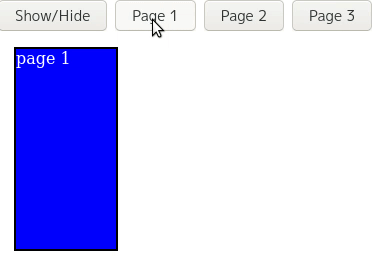

# Vue Resizing Pages

A simple component that accepts a list of pages that you can switch between. When you change pages it automatically:

- resizes to fit the newest page
- Slides the old page off to the side
- Slides the newest page into view from the other side

```bash
yarn add vue-resizing-pager
# or
npm i vue-resizing-pager
```

<br/>



> This component was designed to be used for "tiered popups", very similar to YouTube's video player options popup when you try to change the quality. The player options scroll off to the left, the quality selector scrolls in from the right, and the entire popup is resized.

## Usage

```vue
<template>
  <ResizingPager :page="page">
    <!-- The slot name is the page number, starting at 1 (not 0) -->
    <template #1>
      <div class="page-1">
        <p>Page 1</p>
      </div>
    </template>
    <template #2>
      <div class="page-2">
        <p>Page 2</p>
      </div>
    </template>
    <!-- ... Add as many pages as you'd like -->
  </ResizingPager>
</template>

<script lang="ts">
import { defineComponent } from "vue";
import { ResizingPager } from "vue-resizing-pager";

export default defineComponent({
  components: {
    ResizingPager,
  },
  setup() {
    const page = ref(1);
    
    // To switch pages, simply update the page prop,
    // and the component handles the rest
    const updatePage = (newPage: number) => {
      page.value = newPage;
    };

    return {
      page,
      updatePage,
    };
  },
});
</script>
```

## Styling

To specify the size of the page, simply use CSS to set hard values or use min/maxes with `overflow: auto` to enable scrolling for that page.

```css
.page-1 {
  width: 200px;
  height: 100px;
}

.page-2 {
  min-width: 100px;
  max-width: 200px;
  min-height: 300px;
  max-height: 500px;
  overflow-y: auto;
}
```

It's also not recommended you apply styling or classes directly on the `ResizingPager` because it manages it's own style internally to do the animations.

Once again, this was designed for tiered popups, so you also shouldn't try and set the `ResizingPager`'s width or height to match the popup, instead the popup should just wrap the `ResizingPager`, adjusting it's size to match the size of the component.
